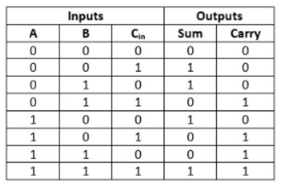
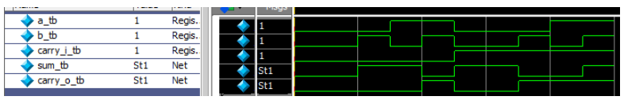

# FULL ADDER

## Introdução

O Half-Adder é utilizado para somar apenas dois números. Para superar essa limitação, o Full Adder foi desenvolvido. O Full Adder é usado para somar três números binários de 1 bit: A, B e o carry C. O Full Adder possui três estados de entrada e dois estados de saída: _sum_ e _carry_.

## Diagrama de Bloco


## Tabela Verdade



## Criação do Módulo

### Código em SystemVerilog


## Visualização RTL


## Teste

### Código Testbench em SystemVerilog

```systemverilog
`timescale 10ns/100ps
module full_adder_tb;
reg a_tb, b_tb, carry_i_tb;
wire sum_tb, carry_o_tb;
full_adder U0(
.a_i(a_tb),
.b_i(b_tb),
.carry_i(carry_i_tb),
.sum_o(sum_tb),
.carry_o(carry_o_tb)
);
initial
begin
 a_tb = 0;
 b_tb = 0;
carry_i_tb = 0;
 #5;
a_tb = 0;
 b_tb = 0;
carry_i_tb = 0;
 #5;
 a_tb = 0;
 b_tb = 1;
 carry_i_tb = 0;
#5;
 a_tb = 1;
 b_tb = 0;
carry_i_tb = 0;
 #5;
 a_tb = 1;
 b_tb = 1;
carry_i_tb = 0;
 #5;
a_tb = 0;
 b_tb = 0;
carry_i_tb = 1;
 #5;
a_tb = 0;
 b_tb = 0;
carry_i_tb = 1;
 #5;
 a_tb = 0;
 b_tb = 1;
carry_i_tb = 1;
 #5;
 a_tb = 1;
 b_tb = 0;
carry_i_tb = 1;
 #5;
 a_tb = 1;
 b_tb = 1;
carry_i_tb = 1;
 #5;
 $stop;
end
always @(a_tb or b_tb or carry_i_tb) $display("s=%b I c=%b", sum_tb,
carry_o_tb);
endmodule
```

## Forma de Onda Resultante



## Display no Terminal do ModelSim


## Considerações

Nota-se pela simulação que o módulo está em funcionamento, dado que a tabela verdade do Full Adder está de acordo com o resultado obtido nos testes, tanto a forma de onda, quanto o resultado escrito no terminal.
