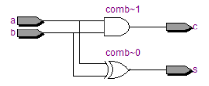

# HALF ADDER

## Introdução

O Half-Adder é um bloco básico usado para somar dois números como duas entradas e produzir duas saídas. O adder é utilizado para realizar a operação OR de dois números binários de um único bit. Os bits do augendo e do adendo são dois estados de entrada, e "carry" e "sum" são dois estados de saída do half adder.

## Diagrama de Bloco


## Tabela Verdade


## Criação do Módulo

### Código em SystemVerilog

```systemverilog
module half_adder(
	a,
	b,
	c,
	s
);

	input a,b;
	output c,s;

	xor(s, a, b);
	and(c, a, b);

endmodule
```

## Visualização RTL



## Teste

### Código Testbench em SystemVerilog

```systemverilog
module half_adder_tb;

	reg a_tb,b_tb;
	wire c_tb,s_tb;


half_adder U0(
	.a(a_tb),
	.b(b_tb),
	.c(c_tb),
	.s(s_tb)
);

initial
begin
	a_tb=0;
	b_tb=0;
	#5;
	a_tb=0;
	b_tb=1;
	#5;
	a_tb=1;
	b_tb=0;
	#5;
	a_tb=1;
	b_tb=1;
	#5;
	$stop;
end

	always @(a_tb or b_tb) $display("Input -> a=%b I b=%b || Output -> c=%b I s=%b", a_tb, b_tb, c_tb, s_tb);

endmodule
```

## Forma de Onda Resultante


## Display no Terminal do ModelSim


## Considerações

Nota-se pela simulação que o módulo está em funcionamento, dado que a tabela verdade do Half Adder está de acordo com o resultado obtido nos testes, tanto a forma de onda, quanto o resultado escrito no terminal.
