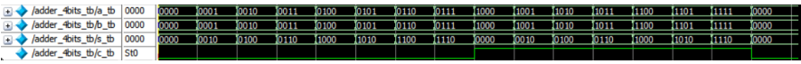
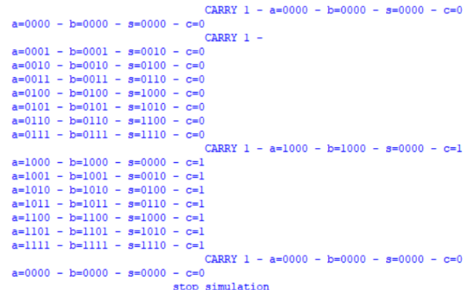

# ADDER 4 BITS

## Introduction

To create an adder with more than one bit, we simply expand our logic, including each bit in pairs using full adders as needed. For a four-bit adder, we will need 4 full adders.

## Module Creation

### SystemVerilog Code

```systemverilog
module adder_4bits (a_i, b_i, s_o, c_o);
input  [3:0] a_i, b_i;
output [3:0] s_o;
output       c_o;
wire [2:0] w_carry;
half_adder U0(
    .a_i(a_i[0]),
    .b_i(b_i[0]),
    .s_o(s_o[0]),
    .c_o(w_carry[0])
);
full_adder U1 (
    .a_i(a_i[1]),
    .b_i(b_i[1]),
    .c_i(w_carry[0]),
    .s_o(s_o[1]),
    .c_o(w_carry[1])
);
full_adder U2 (
    .a_i(a_i[2]),
    .b_i(b_i[2]),
    .c_i(w_carry[1]),
    .s_o(s_o[2]),
    .c_o(w_carry[2])
);
full_adder U3 (
    .a_i(a_i[3]),
    .b_i(b_i[3]),
    .c_i(w_carry[2]),
    .s_o(s_o[3]),
    .c_o(c_o)
);
endmodule
```

## Testing

Our testbench provides possible inputs to verify if the module's logic is working correctly.

### Testbench Code in SystemVerilog

```systemverilog
module adder_4bits_tb;
reg [40*8 : 1] message;
reg [3:0] stim_a_array [0:15];
reg [3:0] stim_b_array [0:15];
integer i;
reg  [3:0] a_tb, b_tb;
wire [3:0] s_tb;
wire       c_tb;
adder_4bits DUT (.a_i(a_tb), .b_i(b_tb), .s_o(s_tb),.c_o(c_tb));
initial begin
  message = "start simulation";
  $readmemb("..\\src\\stimulus_a.txt", stim_a_array);
  $readmemb("..\\src\\stimulus_b.txt", stim_b_array);
  message = "load stimulus";
  for(i=0; i<= 15; i=i+1) begin
    a_tb = stim_a_array[i];
    b_tb = stim_b_array[i];#5;
  end
  message = "stop simulation";#1;
  $stop;
end
always @(a_tb or b_tb) begin
  $display("a=%b -",a_tb," b=%b -", b_tb," s=%b -", s_tb," c=%b", c_tb);
end
always @(message) begin
  $display("%s", message);
end
always @(c_tb) begin
  message = "CARRY 1 - ";
  $display("%s", message ,"a=%b -",a_tb," b=%b -", b_tb," s=%b -", s_tb," c=%b", c_tb);
end
endmodule
```

## Resulting Waveform

The following waveform graph and the testbench output prove that our module is correct.



## ModelSim Terminal Display


