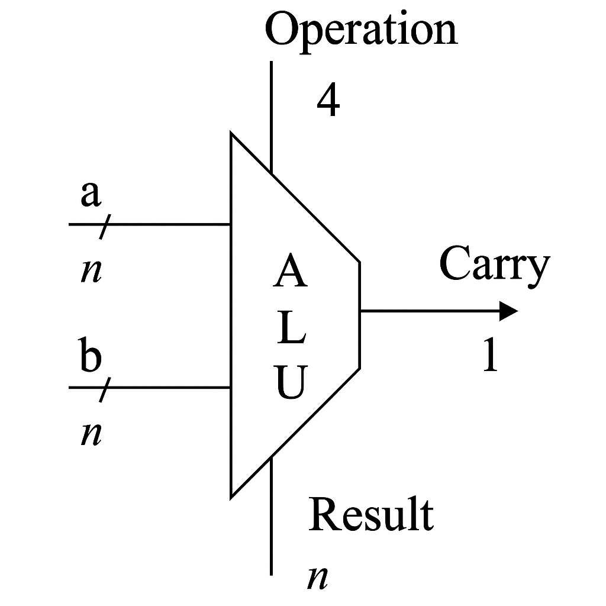

# ARITHMETIC LOGIC UNIT (ULA)

## Introduction

An Arithmetic Logic Unit (ALU) is a fundamental combinational circuit responsible for performing arithmetic and logical operations in digital systems. It takes two input operands and processes them based on a given operation code (opcode). The ALU supports operations such as addition, subtraction, bitwise logic (AND, OR, XOR, etc.), and shift operations. It plays a crucial role in processors and computing units, enabling efficient data manipulation and computation.

The ALU produces an output result based on the selected operation and also generates a carry output in arithmetic operations where overflow might occur. This carry output is essential for multi-bit arithmetic operations, such as multi-byte addition, ensuring accurate calculations in extended precision arithmetic.

## Block Diagram



## Module Creation

### SystemVerilog Code

```systemverilog
/*
	Produced by: Bruno Binelli, Bruno Carboni, Eduardo Zambotto, Julio Cezar;
	Date created - 26/03/2025;
	Description - Arithmetic Logic Unit (ALU)
*/


typedef enum logic [3:0] { // Lisiting all opcodes 
  INC = 4'b0000,  		// Increment A
	DEC = 4'b0001, 			// Decrement A
	ADD = 4'b0010,			// Add A to B
	ADD_C = 4'b0011,		// Add B to A with carry
	SUB_B = 4'b0100,		// Subtraction with borrow
	SUB = 4'b0101,			// Subtraction
	SHIFT_R = 4'b0110,	// Right shift
	SHIFT_L = 4'b0111,	// Left shift
	AND_OP = 4'b1000,		// A AND B
	NAND = 4'b1001,			// A NAND B
	OR = 4'b1010,				// A OR B
	NOR = 4'b1011,			// A NOR B
	XOR = 4'b1100,			// A XOR B
	XNOR = 4'b1101,			// A NOT B
	NOT = 4'b1110,			// Transfer A
	TRF_A = 4'b1111
} opcode_t;

module alu #(parameter N = 8)( // 8 bit parameter as default
	A_i, 
	B_i,
	opcode_i,
	alu_o,
	carry_o
);

	input logic [N-1:0] A_i, B_i;   // Two basic operands
	input opcode_t opcode_i;        // Selection of opcode
	output logic [N-1:0] alu_o;     // Result of the operation
	output logic carry_o;           // Carry of the operation

	logic [N:0] tmp;
	assign tmp = {1'b0,A_i} + {1'b0,B_i};   // tmp will store the carry bit of the sum, by
	assign carry_o = tmp[N];                // extending the two operands and adding them

	always_comb begin
		case (opcode_i)	// Switch case for the opcode
			INC: alu_o = A_i + 1;
			DEC: alu_o = A_i - 1;
			ADD: alu_o = A_i + B_i;
			ADD_C: alu_o = A_i + B_i + 1;
			SUB_B: alu_o = A_i - B_i;
			SUB: alu_o = A_i - B_i - 1;
			SHIFT_R: alu_o = A_i >> B_i;
			SHIFT_L: alu_o = A_i << B_i;
			AND_OP: alu_o = A_i & B_i;
			NAND: alu_o = ~(A_i & B_i);
			OR: alu_o = A_i | B_i;
			NOR: alu_o = ~(A_i | B_i);
			XOR: alu_o = A_i ^ B_i;
			XNOR: alu_o = ~(A_i ^ B_i);
			TRF_A: alu_o = A_i;
			default: alu_o = 0;
		endcase
	end
endmodule

```

## Testing

### Testbench Code in SystemVerilog

```systemverilog
/*
	Produced by: Bruno Binelli, Bruno Carboni, Eduardo Zambotto, Julio Cezar;
	Date created - 29/03/2025;
	Description - Arithmetic Logic Unit (ALU) Testbench
*/

`include "alu.sv";

module alu_tb;

	logic [7:0] A_i, B_i;
	opcode_t opcode_i;
	logic [7:0] alu_o;
	logic carry_o;

	alu U0 (
		.A_i(A_i), 
		.B_i(B_i), 
		.opcode_i(opcode_i), 
		.alu_o(alu_o), 
		.carry_o(carry_o)
	);

  initial begin	// Monitor outputs to track changes
    $monitor("Time = %0t, A_i = %b, B_i = %b, Opcode = %b, alu_o = %b, carry_o = %b", 
             $time, A_i, B_i, opcode_i, alu_o, carry_o);
  end

  initial begin	// Test each opcode
    A_i = 8'b00001111; 
    B_i = 8'b00000000; 
    opcode_i = INC;   // Set the opcode to INC (Increment A)
    #10ns;            // Expected: alu_o = A_i + 1 = 00001111 + 1 = 00010000

    A_i = 8'b00001111; 
    B_i = 8'b00000000; 
    opcode_i = DEC;   // Set the opcode to DEC (Decrement A)
    #10ns;            // Expected: alu_o = A_i - 1 = 00001111 - 1 = 00001110

    A_i = 8'b00001111; 
    B_i = 8'b00000001; 
    opcode_i = ADD;   // Set the opcode to ADD (Add A to B)
    #10ns;            // Expected: alu_o = A_i + B_i = 00001111 + 00000001 = 00010000

    A_i = 8'b00001111; 
    B_i = 8'b00000001; 
    opcode_i = ADD_C; // Set the opcode to ADD_C (Add B to A with carry)
    #10ns;            // Expected: alu_o = A_i + B_i + 1 = 00001111 + 00000001 + 1 = 00010001

    A_i = 8'b00001111; 
    B_i = 8'b00000001; 
    opcode_i = SUB_B; // Set the opcode to SUB_B (Subtraction with borrow)
    #10ns;            // Expected: alu_o = A_i - B_i = 00001111 - 00000001 = 00001110

    A_i = 8'b00001111; 
    B_i = 8'b00000001; 
    opcode_i = SUB;   // Set the opcode to SUB (Subtraction)
    #10ns;            // Expected: alu_o = A_i - B_i - 1 = 00001111 - 00000001 - 1 = 00001101

    A_i = 8'b00001111; 
    B_i = 8'b00000001; 
    opcode_i = SHIFT_R; // Set the opcode to SHIFT_R (Shift right)
    #10ns;              // Expected: alu_o = A_i >> B_i = 00001111 >> 1 = 00000111

    A_i = 8'b00001111; 
    B_i = 8'b00000001; 
    opcode_i = SHIFT_L; // Set the opcode to SHIFT_L (Shift left)
    #10ns;              // Expected: alu_o = A_i << B_i = 00001111 << 1 = 00011110

    A_i = 8'b00001111; 
    B_i = 8'b00000001; 
    opcode_i = AND_OP;  // Set the opcode to AND_OP (A AND B)
    #10ns;              // Expected: alu_o = A_i & B_i = 00001111 & 00000001 = 00000001

    A_i = 8'b00001111; 
    B_i = 8'b00000001; 
    opcode_i = NAND;  // Set the opcode to NAND (A NAND B)
    #10ns;            // Expected: alu_o = ~(A_i & B_i) = ~(00001111 & 00000001) = 11111110

    A_i = 8'b00001111; 
    B_i = 8'b00000001; 
    opcode_i = OR;    // Set the opcode to OR (A OR B)
    #10ns;            // Expected: alu_o = A_i | B_i = 00001111 | 00000001 = 00001111

    A_i = 8'b00001111; 
    B_i = 8'b00000001; 
    opcode_i = NOR;   // Set the opcode to NOR (A NOR B)
    #10ns;            // Expected: alu_o = ~(A_i | B_i) = ~(00001111 | 00000001) = 11110000

    A_i = 8'b00001111; 
    B_i = 8'b00000001; 
    opcode_i = XOR;   // Set the opcode to XOR (A XOR B)
    #10ns;            // Expected: alu_o = A_i ^ B_i = 00001111 ^ 00000001 = 00001110

    A_i = 8'b00001111; 
    B_i = 8'b00000001; 
    opcode_i = XNOR;  // Set the opcode to XNOR (A XNOR B)
    #10ns;            // Expected: alu_o = ~(A_i ^ B_i) = ~(00001111 ^ 00000001) = 11110001

    A_i = 8'b00001111; 
    B_i = 8'b00000000; 
    opcode_i = TRF_A; // Set the opcode to TRF_A (Transfer A)
    #10ns;            // Expected: alu_o = A_i = 00001111

    $stop;
  end

endmodule
```

## Resulting Waveform

The following waveform graph and the testbench output prove that our module is correct.


## ModelSim Terminal Display


