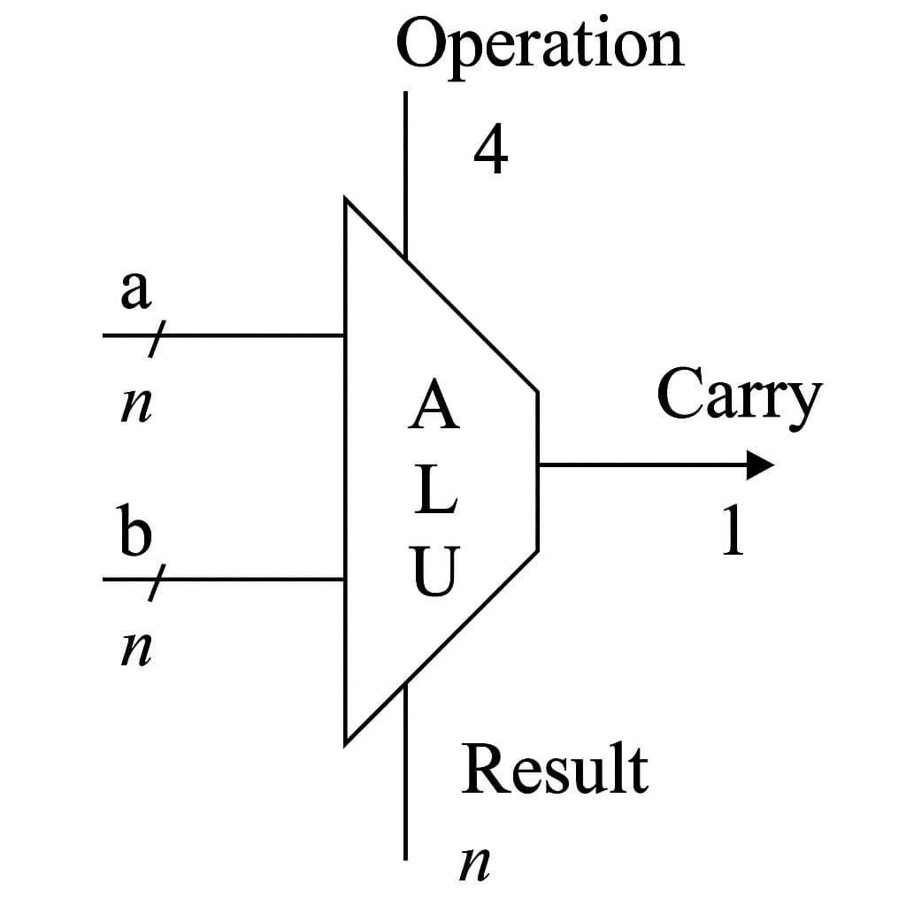
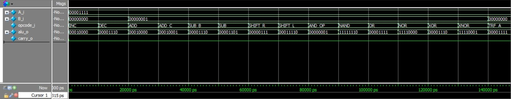
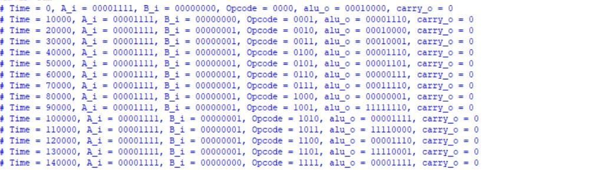

# ARITHMETIC LOGIC UNIT (ULA)

## Introduction

An Arithmetic Logic Unit (ALU) is a fundamental combinational circuit responsible for performing arithmetic and logical operations in digital systems. It takes two input operands and processes them based on a given operation code (opcode). The ALU supports operations such as addition, subtraction, bitwise logic (AND, OR, XOR, etc.), and shift operations. It plays a crucial role in processors and computing units, enabling efficient data manipulation and computation.

The ALU produces an output result based on the selected operation and also generates a carry output in arithmetic operations where overflow might occur. This carry output is essential for multi-bit arithmetic operations, such as multi-byte addition, ensuring accurate calculations in extended precision arithmetic.

## Block Diagram



## Module Creation

### SystemVerilog Code

```systemverilog
/*
	Produced by: Bruno Binelli, Bruno Carboni, Eduardo Zambotto, Julio Cezar;
	Date created - 26/03/2025;
	Description - Arithmetic Logic Unit (ALU)
*/

typedef enum logic [3:0] {
    INC    = 4'b0000,  // Increment A
    DEC    = 4'b0001,  // Decrement A
    ADD    = 4'b0010,  // Add A to B
    ADD_C  = 4'b0011,  // Add A to B with carry-in
    SUB_B  = 4'b0100,  // Subtraction with borrow
    SUB    = 4'b0101,  // Subtraction
    SHIFT_R= 4'b0110,  // Right shift
    SHIFT_L= 4'b0111,  // Left shift
    AND_OP = 4'b1000,  // A AND B
    NAND   = 4'b1001,  // A NAND B
    OR     = 4'b1010,  // A OR B
    NOR    = 4'b1011,  // A NOR B
    XOR    = 4'b1100,  // A XOR B
    XNOR   = 4'b1101,  // A XNOR B
    NOT    = 4'b1110,  // Bitwise NOT A
    TRF_A  = 4'b1111   // Transfer A
} opcode_t;

module alu #(parameter N = 8)(
    input  logic [N-1:0] A_i, B_i, // Two basic operands
    input  opcode_t      opcode_i, // Selection of opcode
    output logic [N-1:0] alu_o,    // Result of the operation
    output logic         carry_o   // Carry of the operation
);

    logic [N:0] tmp; // tmp will store the operantion result
	 
    always_comb begin
        tmp = 0; 
        case (opcode_i)
            INC:    tmp = {1'b0, A_i} + 1;
            DEC:    tmp = {1'b0, A_i} - 1;
            ADD:    tmp = {1'b0, A_i} + {1'b0, B_i};
            ADD_C:  tmp = {1'b0, A_i} + {1'b0, B_i} + 1;
            SUB_B:  tmp = {1'b0, A_i} - {1'b0, B_i};
            SUB:    tmp = {1'b0, A_i} - {1'b0, B_i} - 1;
            SHIFT_R: tmp = {1'b0, A_i >> B_i};
            SHIFT_L: tmp = {1'b0, A_i << B_i};
            AND_OP: tmp = {1'b0, A_i & B_i};
            NAND:   tmp = {1'b0, ~(A_i & B_i)};
            OR:     tmp = {1'b0, A_i | B_i};
            NOR:    tmp = {1'b0, ~(A_i | B_i)};
            XOR:    tmp = {1'b0, A_i ^ B_i};
            XNOR:   tmp = {1'b0, ~(A_i ^ B_i)};
            NOT:    tmp = {1'b0, ~A_i};       
            TRF_A:  tmp = {1'b0, A_i};
            default: tmp = 0;
        endcase
        alu_o   = tmp[N-1:0]; // store the result
        carry_o = tmp[N]; // store the carry                     
    end 

endmodule

```

## Testing

### Testbench Code in SystemVerilog

```systemverilog
/*
	Produced by: Bruno Binelli, Bruno Carboni, Eduardo Zambotto, Julio Cezar;
	Date created - 29/03/2025;
	Description - Arithmetic Logic Unit (ALU) Testbench
*/

`include "alu.sv"

module alu_tb;

    logic [7:0] A_i, B_i;
    opcode_t opcode_i;
    logic [7:0] alu_o;
    logic carry_o;

    alu U0 (
        .A_i(A_i), 
        .B_i(B_i), 
        .opcode_i(opcode_i), 
        .alu_o(alu_o), 
        .carry_o(carry_o)
    );

    initial begin // Monitor outputs to track changes
        $monitor("Time = %0t, A_i = %b, B_i = %b, Opcode = %b, alu_o = %b, carry_o = %b", 
                 $time, A_i, B_i, opcode_i, alu_o, carry_o);
    end

    initial begin // Test each opcode
        // --- Arithmetic ops ---
        A_i = 8'b00001111; B_i = 8'b00000000; opcode_i = INC;
        #10ns;  // Expected: alu_o = 00010000, carry_o = 0

        A_i = 8'b00001111; B_i = 8'b00000000; opcode_i = DEC;
        #10ns;  // Expected: alu_o = 00001110, carry_o = 0

        A_i = 8'b00001111; B_i = 8'b00000001; opcode_i = ADD;
        #10ns;  // Expected: alu_o = 00010000, carry_o = 0

        A_i = 8'b00001111; B_i = 8'b00000001; opcode_i = ADD_C;
        #10ns;  // Expected: alu_o = 00010001, carry_o = 0

        A_i = 8'b00001111; B_i = 8'b00000001; opcode_i = SUB_B;
        #10ns;  // Expected: alu_o = 00001110, carry_o = 0

        A_i = 8'b00001111; B_i = 8'b00000001; opcode_i = SUB;
        #10ns;  // Expected: alu_o = 00001101, carry_o = 0

        // --- Carry test's ---
        A_i = 8'b11111111; B_i = 8'b00000001; opcode_i = ADD;
        #10ns;  // Expected: alu_o = 00000000, carry_o = 1 

        A_i = 8'b11111111; B_i = 8'b00000000; opcode_i = INC;
        #10ns;  // Expected: alu_o = 00000000, carry_o = 1 

        // --- Shifts ---
        A_i = 8'b00001111; B_i = 8'b00000001; opcode_i = SHIFT_R;
        #10ns;  // Expected: alu_o = 00000111

        A_i = 8'b00001111; B_i = 8'b00000001; opcode_i = SHIFT_L;
        #10ns;  // Expected: alu_o = 00011110

        // --- Logics ---
        A_i = 8'b00001111; B_i = 8'b00000001; opcode_i = AND_OP;
        #10ns;  // Expected: alu_o = 00000001

        A_i = 8'b00001111; B_i = 8'b00000001; opcode_i = NAND;
        #10ns;  // Expected: alu_o = 11111110

        A_i = 8'b00001111; B_i = 8'b00000001; opcode_i = OR;
        #10ns;  // Expected: alu_o = 00001111

        A_i = 8'b00001111; B_i = 8'b00000001; opcode_i = NOR;
        #10ns;  // Expected: alu_o = 11110000

        A_i = 8'b00001111; B_i = 8'b00000001; opcode_i = XOR;
        #10ns;  // Expected: alu_o = 00001110

        A_i = 8'b00001111; B_i = 8'b00000001; opcode_i = XNOR;
        #10ns;  // Expected: alu_o = 11110001

        A_i = 8'b00001111; B_i = 8'b00000000; opcode_i = NOT;
        #10ns;  // Expected: alu_o = 11110000  

        A_i = 8'b00001111; B_i = 8'b00000000; opcode_i = TRF_A;
        #10ns;  // Expected: alu_o = 00001111

        $finish;
    end

endmodule
```

## Resulting Waveform

The following waveform graph and the testbench output prove that our module is correct.



## ModelSim Terminal Display


