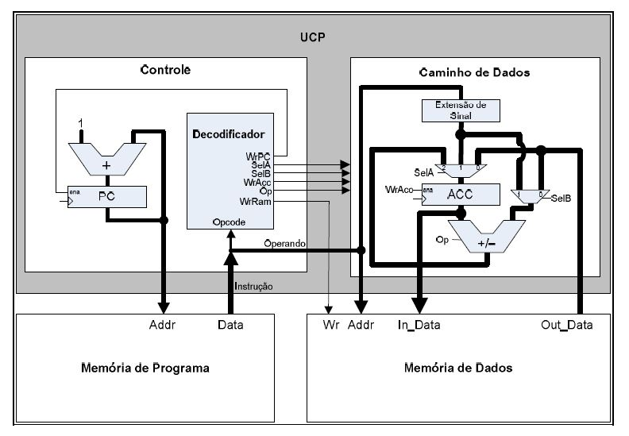
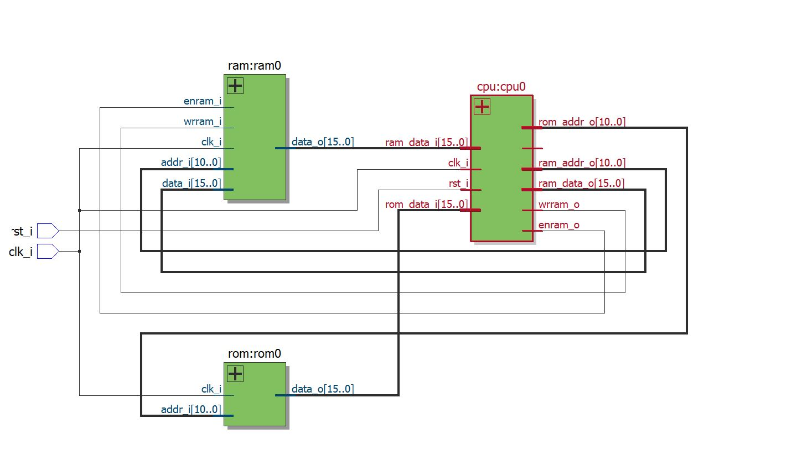
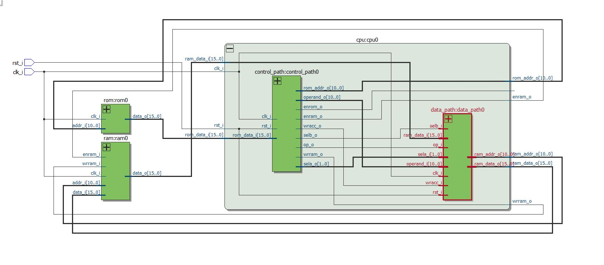
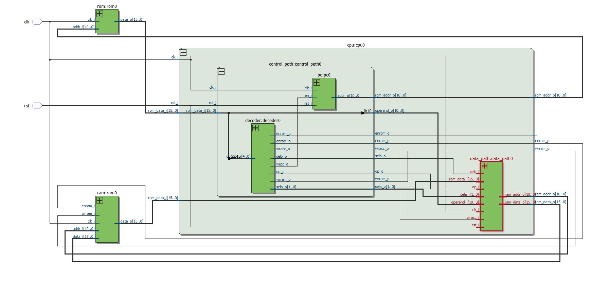
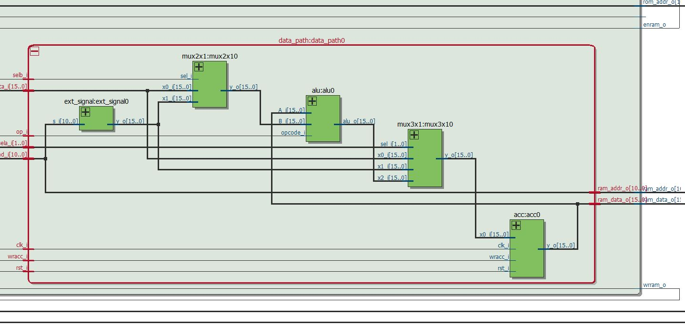
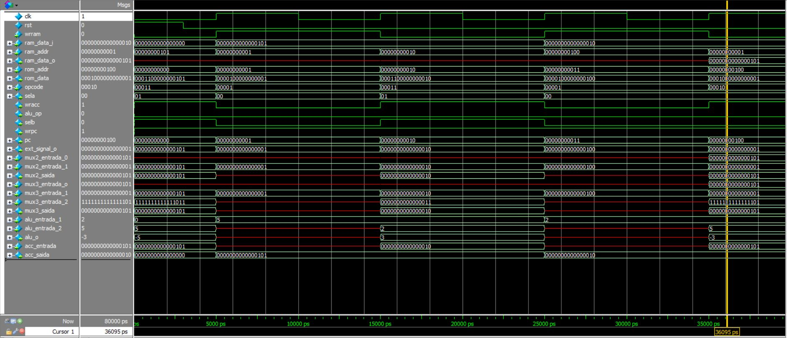
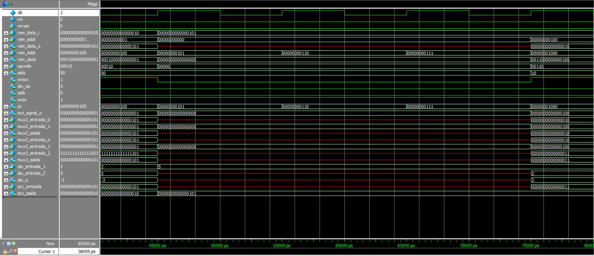
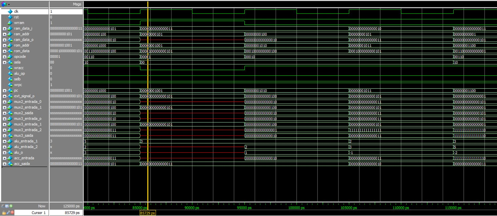
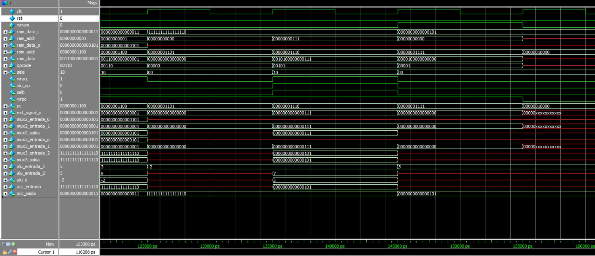

# BIP I PROCESSOR

## Introduction

The BIP (Basic Instruction Processor) is a single-cycle processor developed to execute instructions in a simple and efficient way. Its architecture is based on a basic set of arithmetic and data movement operations, making it a good choice for educational projects and processor prototypes.

The operation of the BIP relies on a single clock cycle for each instruction, where all operations are performed simultaneously. This means that in each clock pulse, the processor fetches the instruction, decodes, and executes it, resulting in fast execution but with limitations in complexity and efficiency for more elaborate instructions.

The BIP has two main units: Control and Data Path. The Control unit is responsible for coordinating data flow and operations through instruction decoding, while the Data Path performs arithmetic and logical operations. The processor uses a program memory to store instructions and a data memory to manipulate values during execution.

With its compact and easy-to-understand architecture, the BIP is widely used for didactic purposes, providing a solid foundation for understanding processor architecture concepts and instruction execution.

## Block Diagram



## Module Creation

### Accumulator
The accumulator is a fundamental component of the BIP processor that stores intermediate results of arithmetic and logical operations. It is a 16-bit register that can:
- Store data from memory or immediate values
- Hold results from arithmetic operations (ADD, SUB)
- Provide data for memory write operations
- Interface with the ALU for computations

### Mux2x1
The 2-to-1 multiplexer is a combinational circuit that selects between two 16-bit inputs based on a control signal. It is used to:
- Select between memory data and immediate values
- Choose between different data paths in the processor
- Control data flow in the data path
- Implement conditional operations

### Mux3x1
The 3-to-1 multiplexer is a more complex selection circuit that chooses between three 16-bit inputs using a 2-bit control signal. It is used to:
- Select between memory data, accumulator value, and immediate values
- Implement more complex data routing in the processor
- Support multiple operation modes
- Enable flexible data path configurations

### SystemVerilog Code
```systemverilog
module bip #(parameter FILE_NAME = "memory_rom.bin")(
    clk_i,
    rst_i
);

    input logic clk_i, rst_i;
    logic [10:0] ram_addr, rom_addr;
    logic [15:0] ram_data_a, ram_data_b, rom_data;
    logic wrram, enram;

    ram ram0 (.clk_i(clk_i), .enram_i(enram), .wrram_i(wrram), .addr_i(ram_addr), .data_i(ram_data_a), .data_o(ram_data_b));

    rom #(.FILE_NAME(FILE_NAME)) rom0 (.clk_i(clk_i), .addr_i(rom_addr), .data_o(rom_data));
        
    cpu cpu0 (.enrom_o(enrom), .enram_o(enram), .clk_i(clk_i), .rst_i(rst_i), .rom_addr_o(rom_addr), .rom_data_i(rom_data), .ram_addr_o(ram_addr), .ram_data_i(ram_data_b), .ram_data_o(ram_data_a), .wrram_o(wrram));

endmodule:bip
```

## RTL Visualization

### Top Level Design

*Figura 1: Visualização RTL do nível superior do processador BIP, mostrando as interconexões entre CPU, RAM e ROM*

### CPU Module

*Figura 2: Visualização RTL do módulo CPU, detalhando a unidade de controle e o data path*

### Data Path

*Figura 3: Visualização RTL do Data Path, mostrando o acumulador, multiplexadores e unidades aritméticas*

### Control Unit

*Figura 4: Visualização RTL da unidade de controle, detalhando a lógica de decodificação de instruções*

## ROM Memory

```
0001100000000101 // LDI 5
0000100000000001 // STO 1
0001100000000010 // LDI 2
0000100000000100 // STO 4
0001000000000001 // LD 1
0000000000000000 // NOP 
0000000000000000 // NOP
0000000000000000 // NOP
0011000000000100 // SUB 4
0000100000000101 // STO 5
0001000000000100 // LD 4
0001000000000101 // LD 5
0011000000000001 // SUB 1
0000000000000000 // NOP
0010100000000111 // ADDI 7
0000100000000000 // STO 0
```

## Testing

### Testbench Code in SystemVerilog
```systemverilog
module bip_tb;

  logic clk = 0;
  logic rst = 1; // Start reseting the bip processor

  bip #(.FILE_NAME("memory_rom.bin")) bip0(.clk_i(clk), .rst_i(rst));

  initial forever begin
    #5ns clk = ~clk;
  end     
    
  initial begin
    #3ns rst = ~rst;
  end
    
  initial forever begin
    #10ns;
    $display("---------------");
    $display("Acumulador: %0d", $signed(bip0.cpu0.data_path0.acc0.y_o));
    $display("---------------");  
    $display("               ");
    $display("---------------");  
    for (int i = 0; i < 6; i++) begin
			$display("Memory[%0d]: %h", i, bip0.ram0.memory[i]);
    end
    $display("---------------");
    $display("               ");
  end
   
endmodule:bip_tb
```

### Resulting Waveforms

The following waveform graphs show the execution of all 16 clock pulses from the ROM memory:






The waveform graphs above and the testbench output prove that our module is correct.

## ModelSim Terminal Display

The following output shows the system response for each clock cycle, displaying the accumulator value and memory contents:

```
Clock Cycle 1:
run
run
---------------
Acumulador: 5
---------------
Memory[0]: xxxx
Memory[1]: xxxx
Memory[2]: xxxx
Memory[3]: xxxx
Memory[4]: xxxx
Memory[5]: xxxx
---------------

Clock Cycle 2:
run
run
---------------
Acumulador: 5
---------------
Memory[0]: xxxx
Memory[1]: 0005
Memory[2]: xxxx
Memory[3]: xxxx
Memory[4]: xxxx
Memory[5]: xxxx
---------------

Clock Cycle 3:
run
run
---------------
Acumulador: 2
---------------
Memory[0]: xxxx
Memory[1]: 0005
Memory[2]: xxxx
Memory[3]: xxxx
Memory[4]: xxxx
Memory[5]: xxxx
---------------

Clock Cycle 4:
run
run
---------------
Acumulador: 2
---------------
Memory[0]: xxxx
Memory[1]: 0005
Memory[2]: xxxx
Memory[3]: xxxx
Memory[4]: 0002
Memory[5]: xxxx
---------------

Clock Cycle 5:
run
run
---------------
Acumulador: 5
---------------
Memory[0]: xxxx
Memory[1]: 0005
Memory[2]: xxxx
Memory[3]: xxxx
Memory[4]: 0002
Memory[5]: xxxx
---------------

Clock Cycle 6:
run
run
---------------
Acumulador: 5
---------------
Memory[0]: xxxx
Memory[1]: 0005
Memory[2]: xxxx
Memory[3]: xxxx
Memory[4]: 0002
Memory[5]: xxxx
---------------

Clock Cycle 7:
run
run
---------------
Acumulador: 5
---------------
Memory[0]: xxxx
Memory[1]: 0005
Memory[2]: xxxx
Memory[3]: xxxx
Memory[4]: 0002
Memory[5]: xxxx
---------------

Clock Cycle 8:
run
run
---------------
Acumulador: 5
---------------
Memory[0]: xxxx
Memory[1]: 0005
Memory[2]: xxxx
Memory[3]: xxxx
Memory[4]: 0002
Memory[5]: xxxx
---------------

Clock Cycle 9:
run
run
---------------
Acumulador: 3
---------------
Memory[0]: xxxx
Memory[1]: 0005
Memory[2]: xxxx
Memory[3]: xxxx
Memory[4]: 0002
Memory[5]: xxxx
---------------

Clock Cycle 10:
run
run
---------------
Acumulador: 3
---------------
Memory[0]: xxxx
Memory[1]: 0005
Memory[2]: xxxx
Memory[3]: xxxx
Memory[4]: 0002
Memory[5]: 0003
---------------

Clock Cycle 11:
run
run
---------------
Acumulador: 2
---------------
Memory[0]: xxxx
Memory[1]: 0005
Memory[2]: xxxx
Memory[3]: xxxx
Memory[4]: 0002
Memory[5]: 0003
---------------

Clock Cycle 12:
run
run
---------------
Acumulador: 3
---------------
Memory[0]: xxxx
Memory[1]: 0005
Memory[2]: xxxx
Memory[3]: xxxx
Memory[4]: 0002
Memory[5]: 0003
---------------

Clock Cycle 13:
run
run
---------------
Acumulador: -2
---------------
Memory[0]: xxxx
Memory[1]: 0005
Memory[2]: xxxx
Memory[3]: xxxx
Memory[4]: 0002
Memory[5]: 0003
---------------

Clock Cycle 14:
run
run
---------------
Acumulador: -2
---------------
Memory[0]: xxxx
Memory[1]: 0005
Memory[2]: xxxx
Memory[3]: xxxx
Memory[4]: 0002
Memory[5]: 0003
---------------

Clock Cycle 15:
run
run
---------------
Acumulador: 5
---------------
Memory[0]: xxxx
Memory[1]: 0005
Memory[2]: xxxx
Memory[3]: xxxx
Memory[4]: 0002
Memory[5]: 0003
---------------

Clock Cycle 16:
run
run
---------------
Acumulador: 5
---------------
Memory[0]: 0005
Memory[1]: 0005
Memory[2]: xxxx
Memory[3]: xxxx
Memory[4]: 0002
Memory[5]: 0003
---------------