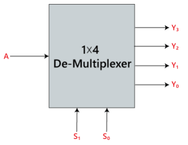
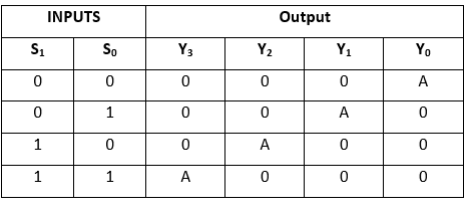
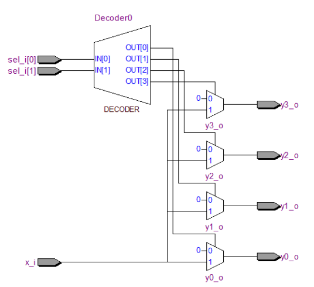
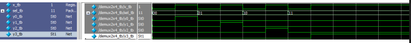
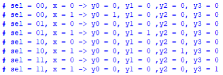

# FULL ADDER

## Introduction

A De-multiplexer is a combinational circuit that has only 1 input
line and 2N output lines. Simply, the multiplexer is a single-input and
multi-output combinational circuit. The information is received from the single
input lines and directed to the output line. On the basis of the values of the
selection lines, the input will be connected to one of these outputs.
De-multiplexer is opposite to the multiplexer


## Block Diagram



## Truth Table



## Module Creation

### SystemVerilog Code

```systemverilog
module demux1x4
(
    x_i,
	 sel_i,
	 y0_o,
	 y1_o,
	 y2_o,
	 y3_o
);
	
	input logic x_i;
	input logic [1:0] sel_i;
	output logic y0_o, y1_o, y2_o, y3_o;
	
	always_comb
	begin
		y0_o = 1'b0;
        y1_o = 1'b0;
        y2_o = 1'b0;
        y3_o = 1'b0;
		
		case(sel_i)
			2'b00 : y0_o = x_i;
			2'b01 : y1_o = x_i;
			2'b10 : y2_o = x_i;
			2'b11 : y3_o = x_i;
			default: $display("Invalid sel input");
		endcase
	end


endmodule
```

## RTL Visualization



## Testing

### Testbench Code in SystemVerilog

```systemverilog
module demux1x4_tb;
	
	reg x_tb;
	reg[1:0] sel_tb;
	wire y0_tb, y1_tb, y2_tb, y3_tb;
	
	demux1x4 U0(
	    .x_i(x_tb),
	    .sel_i(sel_tb),
	    .y0_o(y0_tb),
	    .y1_o(y1_tb),
	    .y2_o(y2_tb),
	    .y3_o(y3_tb)
	);
	
initial begin
    $monitor("sel = %b, x = %b -> y0 = %0b, y1 = %0b ,y2 = %0b, y3 = %0b", sel_tb,x_tb, y0_tb,y1_tb,y2_tb,y3_tb);
    sel_tb=2'b00; x_tb=0; #1;
    sel_tb=2'b00; x_tb=1; #1;
    sel_tb=2'b01; x_tb=0; #1;
    sel_tb=2'b01; x_tb=1; #1;
    sel_tb=2'b10; x_tb=0; #1;
    sel_tb=2'b10; x_tb=1; #1;
    sel_tb=2'b11; x_tb=0; #1;
    sel_tb=2'b11; x_tb=1; #1;
  end
endmodule
```

## Resulting Waveform



## ModelSim Terminal Display



