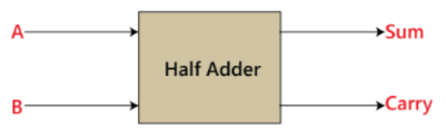

# HALF ADDER

## Introduction

The Half-Adder is a basic block used to add two numbers as inputs and produce two outputs. The adder is used to perform the OR operation of two single-bit binary numbers. The augend and addend bits are two input states, and "carry" and "sum" are two output states of the half adder.

## Block Diagram



## Truth Table


## Module Creation

### SystemVerilog Code

```systemverilog
module half_adder(
    a,
    b,
    c,
    s
);

    input a,b;
    output c,s;

    xor(s, a, b);
    and(c, a, b);

endmodule
```

## RTL Visualization


## Testing

### Testbench Code in SystemVerilog

```systemverilog
module half_adder_tb;

    reg a_tb,b_tb;
    wire c_tb,s_tb;


half_adder U0(
    .a(a_tb),
    .b(b_tb),
    .c(c_tb),
    .s(s_tb)
);

initial
begin
    a_tb=0;
    b_tb=0;
    #5;
    a_tb=0;
    b_tb=1;
    #5;
    a_tb=1;
    b_tb=0;
    #5;
    a_tb=1;
    b_tb=1;
    #5;
    $stop;
end

    always @(a_tb or b_tb) $display("Input -> a=%b I b=%b || Output -> c=%b I s=%b", a_tb, b_tb, c_tb, s_tb);

endmodule
```

## Resulting Waveform


## ModelSim Terminal Display


## Considerations

It can be observed from the simulation that the module is functioning correctly, as the Half Adder's truth table matches the results obtained in the tests, both in the waveform and in the terminal output.
