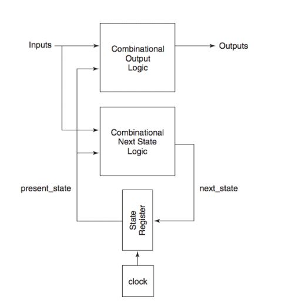
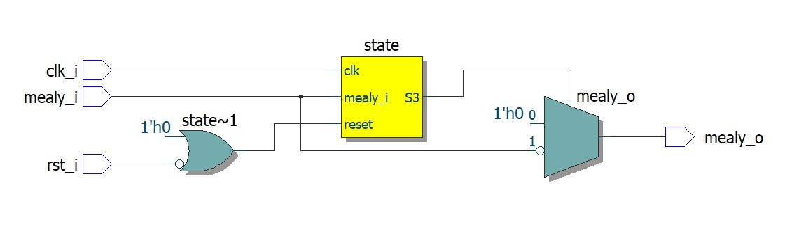
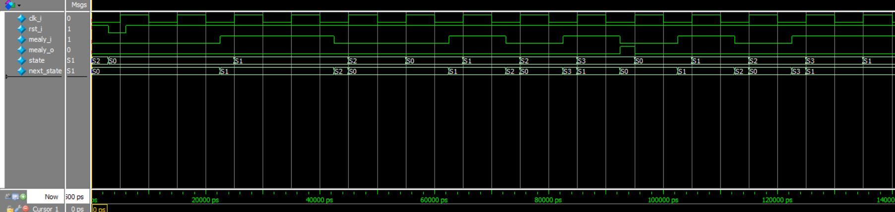
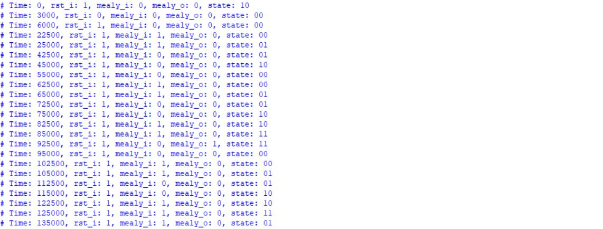

# MEALY FINITE STATE MACHINE

## Introduction

A Mealy Finite State Machine (FSM) is a type of sequential logic circuit where the outputs depend on both the current state and the current input. This structure allows the system to react immediately to changes in the input, as output transitions can occur within the same clock cycle. The Mealy FSM consists of a set of defined states, input conditions, and corresponding transitions, enabling it to model complex control behaviors.

## Block Diagram



## Module Creation

### SystemVerilog Code

```systemverilog
/*
	Produced by: Bruno Binelli, Bruno Carboni, Eduardo Zambotto, Julio Cezar;
	Date created - 03/2025;
	Description - Melay Finite State Machine with a 2-bit state register.
*/

/*
 States transition logic:
	{current_state}
		({input}, {output}) -> {next_state}
				     			. . .
	S0:
	    (0,0) -> S0
		(1,0) -> S1
	S1:
		(0,0) -> S2
		(1,0) -> S1
	S2:
		(0,0) -> S0
		(1,0) -> S3
	S3:
		(0,1) -> S0
		(1,0) -> S1
*/

module mealy_fsm(
	clk_i,
	rst_i,
	mealy_i,
	mealy_o
);

input clk_i;
input rst_i;
input mealy_i;
output logic mealy_o;

typedef enum logic [1:0]{ // Listing all states
	S0 = 2'b00,
	S1 = 2'b01,
	S2 = 2'b10,
	S3 = 2'b11
} state_t;

state_t state, next_state;

always_comb begin : next_state_logic
	
	mealy_o = 1'b0;
	
	case(state)
		S0: begin
			if (mealy_i)
				next_state = S1;
			else
				next_state = S0;
		end
		S1: begin
			if(mealy_i)
				next_state = S1;
			else
				next_state = S2;
		end
		S2: begin
			if(mealy_i)
				next_state = S3;
			else
				next_state = S0;
		end
		S3: begin
			if(mealy_i)
				next_state = S1;
			else begin
				next_state = S0;
				mealy_o = 1'b1;
			end
		end
		default: begin 
			next_state = S0;
		end
	endcase
end

always_ff @(posedge clk_i or negedge rst_i) begin : state_transition

	if (!rst_i)
		state <= S0;
	else
		state <= next_state;

end

endmodule
```

## RTL Visualization



## Testing

### Testbench Code in SystemVerilog

```systemverilog
/*
	Produced by: Bruno Binelli, Bruno Carboni, Eduardo Zambotto, Julio Cezar;
	Date created - 03/2025;
	Description - Melay Finite State Machine with a 2-bit state register Testbench
*/

module mealy_fsm_tb;

logic clk_i, rst_i, mealy_i, mealy_o;

mealy_fsm U0 (.clk_i(clk_i), .rst_i(rst_i), .mealy_i(mealy_i), .mealy_o(mealy_o));

task run_machine (input logic x_i);
	mealy_i = x_i;
	#10ns;
endtask

initial begin: initializing_inputs
	clk_i = 1'b0;
	mealy_i = 1'b0;
	U0.state = U0.S2; // Initialized in S2 to test the reset
end: initializing_inputs

initial begin: reset_forcing
	rst_i = 1'b1;
	#3ns rst_i = 1'b0;
	#3ns rst_i = 1'b1;
end: reset_forcing

initial begin: clock_generator
	forever begin
		#5ns clk_i = ~clk_i;
	end
end: clock_generator

initial begin: testing_inputs
	$monitor("Time: %0t, rst_i: %b, mealy_i: %b, mealy_o: %b, state: %b", $time, rst_i, mealy_i, mealy_o, U0.state);
	#12.5ns;
	
	run_machine(0); // Remains in S0
	run_machine(1); // S0 to S1
	
	run_machine(1); // Remains in S1
	run_machine(0); // S1 to S2
	
	run_machine(0); // Returns to S0
	
	run_machine(1); // Making the same steps to return to S2
	run_machine(0);
	
	run_machine(1); // S2 to S3
	
	run_machine(0); // Returns to S0
	
	run_machine(1); // Making the same steps to return to S3
	run_machine(0);
	run_machine(1);
	
	run_machine(1); // Returns to S1
	
	$stop;
	
end: testing_inputs

endmodule
```

## Resulting Waveform

The following waveform graph and the testbench output prove that our module is correct.



## ModelSim Terminal Display


