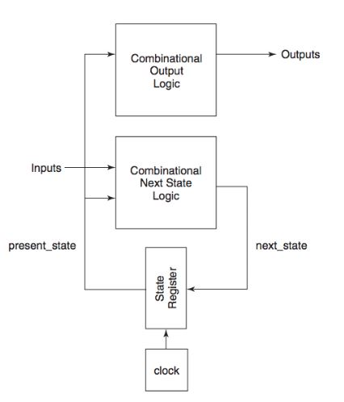
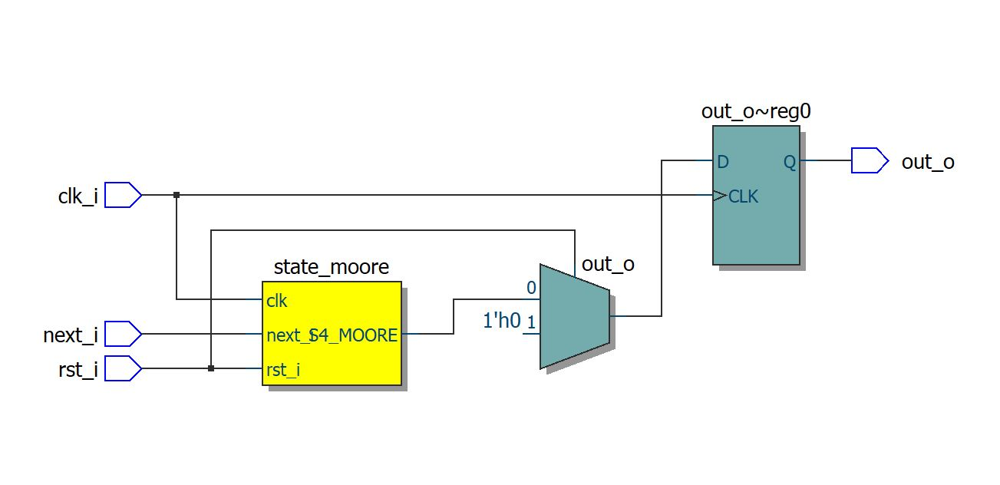
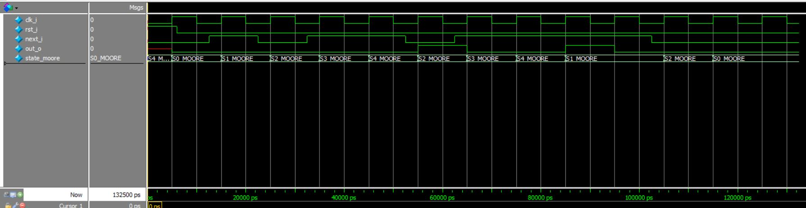
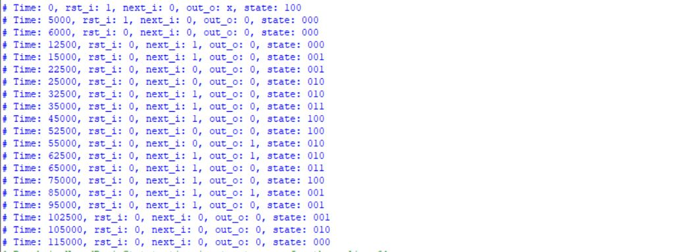

# MOORE FINITE STATE MACHINE

## Introduction

A Moore Finite State Machine (FSM) is a type of sequential circuit used to control digital systems through a defined set of states. It operates based on a clock signal and input values, transitioning between states according to a state transition logic. In Moore machines, the output is determined solely by the current state, providing predictable and stable output behavior.

## Block Diagram



## Module Creation

### SystemVerilog Code

```systemverilog
/*
    Produced by: Bruno Binelli, Bruno Carboni, Eduardo Zambotto, Julio Cezar;
    Date created - 03/2025;
    Description - Moore Finite State Machine
*/

module moore_fsm(
	
	clk_i,
	rst_i,
	next_i,
	out_o

);

input logic clk_i, rst_i, next_i;
output logic out_o;

typedef enum logic [2:0] { // Listing all states
        S0_MOORE, 
        S1_MOORE, 
        S2_MOORE, 
        S3_MOORE, 
        S4_MOORE 
    } states_moore;
    states_moore state_moore;
	 
	 
always_ff @(posedge clk_i) begin
        if (rst_i) begin
            out_o <= 1'b0;
            state_moore <= S0_MOORE;
        end else begin
            case (state_moore) 
                S0_MOORE: begin
                    out_o <= 1'b0;
                    if (next_i) begin
                        state_moore <= S1_MOORE;
                    end
                end

                S1_MOORE: begin 
                    out_o <= 1'b0;
                    if (!next_i) begin 
                        state_moore <= S2_MOORE;
                    end else begin
                        state_moore <= S1_MOORE;
                    end
                end

                S2_MOORE: begin // 10
                    out_o <= 1'b0;
                    if (next_i) begin // 101
                        state_moore <= S3_MOORE;
                    end else begin
                        state_moore <= S0_MOORE;
                    end
                end

                S3_MOORE: begin 
                    out_o <= 1'b0;
                    if (next_i) begin 
                        state_moore <= S4_MOORE;
                    end else begin
                        state_moore <= S2_MOORE;
                    end
                end

                S4_MOORE: begin 
                    out_o <= 1'b1;
                    if (next_i) begin
                        state_moore <= S1_MOORE;
                    end else begin
                        state_moore <= S2_MOORE;
                    end
                end

                default: begin
                    out_o <= 1'b0;
                    state_moore <= S0_MOORE; 
                end
            endcase
        end
    end	 

endmodule
```

## RTL Visualization



## Testing

### Testbench Code in SystemVerilog

```systemverilog
/*
    Produced by: Bruno Binelli, Bruno Carboni, Eduardo Zambotto, Julio Cezar;
    Date created - 29/03/2025;
    Description - Moore Finite State Machine Testbench
*/

module moore_fsm_tb;

logic clk_i, rst_i, next_i, out_o;

moore_fsm U0 (.clk_i(clk_i), .rst_i(rst_i), .next_i(next_i), .out_o(out_o));

initial begin // Setting intial clokc and next state input as 0 and forcing initial reset
	clk_i = 1'b0;
	next_i = 1'b0;
	U0.state_moore = U0.S4_MOORE;
end

initial begin: clock_generator
	forever begin
	#5ns clk_i = ~clk_i;	
	end
end: clock_generator

initial begin: reset_forcing
	rst_i = 1'b1;
	#6ns rst_i = 1'b0;
end: reset_forcing

initial begin: testing_inputs
	$monitor("Time: %0t, rst_i: %b, next_i: %b, out_o: %b, state: %b", $time, rst_i, next_i, out_o, U0.state_moore);
	#12.5ns;
	
	next_i = 1'b1;  // S0 to S1, q_out = 0
    #10ns;
	
    next_i = 1'b0;  // S1 to S2, q_out = 0
	#10ns;
	
    next_i = 1'b1;  // S2 to S3, q_out = 0
    #10ns;
	
	next_i = 1'b1;  // S3 to S4, q_out = 1
    #10ns;
	
	next_i = 1'b0;  // S4 to S2, q_out = 0
    #10ns;
	
	next_i = 1'b1;  // S2 to S3, q_out = 0
    #10ns;
	
    next_i = 1'b1;  // S3 to S4, q_out = 1
    #10ns;
	
    next_i = 1'b1;  // S4 to S1, q_out = 0
    #10ns;
	
	next_i = 1'b1;  // S1 to S1, q_out = 0
    #10ns;
	
	next_i = 1'b0;  // S1 to S2, q_out = 0
    #10ns;
	
	next_i = 1'b0;  // S2 to S0, q_out = 0
    #10ns;
	
	next_i = 1'b0;  // S0 to S0, q_out = 0
    #10ns;

    $stop;
end: testing_inputs

endmodule
```

## Resulting Waveform

The following waveform graph and the testbench output prove that our module is correct.



## ModelSim Terminal Display


