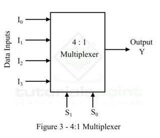
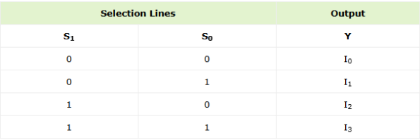
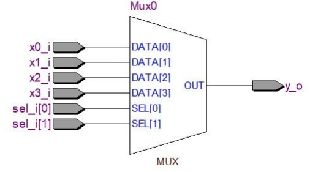
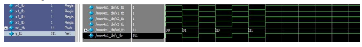
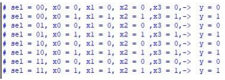

# FULL ADDER

## Introduction

As already mentioned, a multiplexer, also referred to as MUX, is a
combination logic circuit that is designed to accept multiple input signals
and transfer only one of them through the output line. In simple words, a
multiplexer is a digital logic device that selects one-out-of-N (N = 2n)
input data sources and transmits the selected data to a single output line.


## Block Diagram



## Truth Table



## Module Creation

### SystemVerilog Code

```systemverilog
module mux4x1(
	x0_i,
	x1_i,
	x2_i,
	x3_i,
	sel_i,
	y_o
);

input logic x0_i, x1_i, x2_i, x3_i;
input logic [1:0] sel_i;
output logic y_o;

always_comb begin

	case(sel_i)
			2'b00 : y_o = x0_i;
			2'b01 : y_o = x1_i;
			2'b10 : y_o = x2_i;
			2'b11 : y_o = x3_i;
			default: $display("Invalid sel input");
		endcase

end

endmodule
```

## RTL Visualization



## Testing

### Testbench Code in SystemVerilog

```systemverilog
module mux4x1_tb;

reg x0_tb, x1_tb, x2_tb, x3_tb;
reg [1:0] sel_tb;
wire y_tb;

mux4x1 U0(
	    .y_o(y_tb),
	    .sel_i(sel_tb),
	    .x0_i(x0_tb),
	    .x1_i(x1_tb),
	    .x2_i(x2_tb),
	    .x3_i(x3_tb)
	);

initial begin
  $monitor("sel = %b, x0 = %b, x1 = %0b, x2 = %0b ,x3 = %0b,->  y = %0b", sel_tb,x0_tb, x1_tb,x2_tb,x3_tb,y_tb);
  sel_tb=2'b00; x0_tb=0; x1_tb =0; x2_tb=0; x3_tb=0; #1;
	sel_tb=2'b00; x0_tb=1; x1_tb =1; x2_tb=1; x3_tb=1; #1;
	sel_tb=2'b01; x0_tb=0; x1_tb =0; x2_tb=0; x3_tb=0; #1;
	sel_tb=2'b01; x0_tb=1; x1_tb =1; x2_tb=1; x3_tb=1; #1;
	sel_tb=2'b10; x0_tb=0; x1_tb =0; x2_tb=0; x3_tb=0; #1;
	sel_tb=2'b10; x0_tb=1; x1_tb =1; x2_tb=1; x3_tb=1; #1;
	sel_tb=2'b11; x0_tb=0; x1_tb =0; x2_tb=0; x3_tb=0; #1;
	sel_tb=2'b11; x0_tb=1; x1_tb =1; x2_tb=1; x3_tb=1; #1;
    
  end
endmodule
```

## Resulting Waveform



## ModelSim Terminal Display



